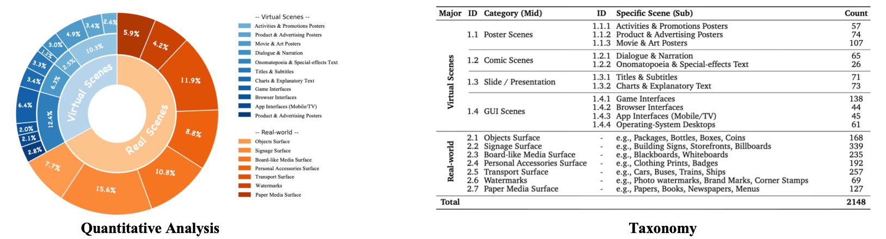
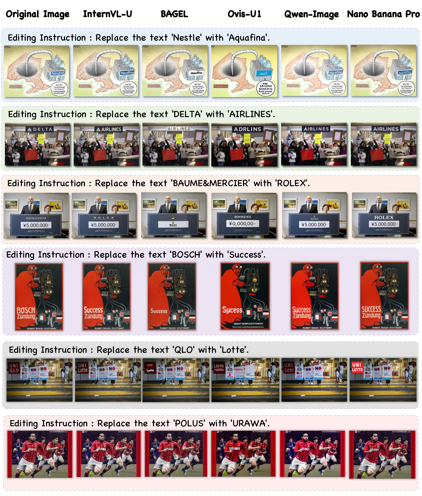

<div align="center">

# TextEdit: A High-Quality, Multi-Scenario Text Editing Benchmark for Generation Models

<p align="center">
  <a href='#'>
    
  </a>
  <a href='https://huggingface.co/datasets/opencompass/TextEdit'>
    
  </a>
  
[Danni Yang](https://scholar.google.com/citations?user=qDsgBJAAAAAJ&hl=zh-CN&oi=sra),
[Sitao Chen](https://github.com/fudan-chen),
[Changyao Tian](https://scholar.google.com/citations?user=kQ3AisQAAAAJ&hl=zh-CN&oi=ao)

If you find our work helpful, please give us a ⭐ or cite our paper. See the InternVL-U technical report appendix for more details.

</div>

## 🎉 News
- **[2026/03/06]** TextEdit benchmark released. 
- **[2026/03/06]** Evaluation code released.
- **[2026/03/06]** Leaderboard updated with latest models.


## 📖 Introduction
 
Text editing is a fundamental yet challenging capability for modern image generation and editing models.  An increasing number of powerful multimodal generation models, such as Qwen-Image and Nano-Banana-Pro, are emerging with strong text rendering and editing capabilities.
For text editing task, unlike general image editing, text manipulation requires:

- Precise spatial alignment
- Font and style consistency
- Background preservation
- Layout-constrained reasoning

We introduce **TextEdit**, a **high-quality**,  **multi-scenario benchmark** designed to evaluate **fine-grained text editing capabilities** in image generation models.

TextEdit covers a diverse set of real-world and virtual scenarios, spanning **18 subcategories** with a total of **2,148 high-quality source images** and **manually annotated edited ground-truth images**.

To comprehensively assess model performance, we combine **classic OCR, image-fidelity metrics and modern multimodal LLM-based evaluation** across _target accuracy_, _text preservation_, _scene integrity_, _local realism_ and _visual coherence_.  This dual-track protocol enables comprehensive assessment.

Our goal is to provide a **standardized, realistic, and scalable** benchmark for text editing research.

---

## 🏆 LeadBoard
<details>
  <summary><strong>📊 Full Benchmark Results</strong></summary>
<div style="max-width:1050px; margin:auto;">

<table>
<thead>
  <tr>
    <th rowspan="2" align="left">Models</th>
    <th rowspan="2" align="center"># Params</th>
    <th colspan="7" align="center">Real</th>
    <th colspan="7" align="center">Virtual</th>
  </tr>
  <tr>
    <th>OA</th>
    <th>OP</th>
    <th>OR</th>
    <th>F1</th>
    <th>NED</th>
    <th>CLIP</th>
    <th>AES</th>
    <th>OA</th>
    <th>OP</th>
    <th>OR</th>
    <th>F1</th>
    <th>NED</th>
    <th>CLIP</th>
    <th>AES</th>
  </tr>
</thead>
<tbody>
  <tr>
    <td colspan="16"><strong><em>Generation Models</em></strong></td>
  </tr>
  <tr>
    <td>Qwen-Image-Edit</td>
    <td align="center">20B</td>
    <td>0.75</td><td>0.68</td><td>0.66</td><td>0.67</td><td>0.71</td><td>0.75</td><td>5.72</td>
    <td>0.78</td><td>0.75</td><td>0.73</td><td>0.74</td><td>0.75</td><td>0.81</td><td>5.21</td>
  </tr>
  <tr>
    <td>GPT-Image-1.5</td>
    <td align="center">-</td>
    <td>0.74</td><td>0.69</td><td>0.67</td><td>0.68</td><td>0.68</td><td>0.75</td><td>5.78</td>
    <td>0.73</td><td>0.72</td><td>0.71</td><td>0.71</td><td>0.70</td><td>0.80</td><td>5.28</td>
  </tr>
  <tr>
    <td>Nano Banana Pro</td>
    <td align="center">-</td>
    <td>0.77</td><td>0.72</td><td>0.70</td><td>0.71</td><td>0.72</td><td>0.75</td><td>5.79</td>
    <td>0.80</td><td>0.78</td><td>0.77</td><td>0.78</td><td>0.78</td><td>0.81</td><td>5.28</td>
  </tr>

  <tr>
    <td colspan="16"><strong><em>Unified Models</em></strong></td>
  </tr>
  <tr>
    <td>Lumina-DiMOO</td>
    <td align="center">8B</td>
    <td>0.22</td><td>0.23</td><td>0.19</td><td>0.20</td><td>0.19</td><td>0.69</td><td>5.53</td>
    <td>0.22</td><td>0.25</td><td>0.21</td><td>0.22</td><td>0.20</td><td>0.72</td><td>4.76</td>
  </tr>
  <tr>
    <td>Ovis-U1</td>
    <td align="center">2.4B+1.2B</td>
    <td>0.40</td><td>0.37</td><td>0.34</td><td>0.35</td><td>0.35</td><td>0.72</td><td>5.32</td>
    <td>0.37</td><td>0.40</td><td>0.38</td><td>0.39</td><td>0.33</td><td>0.75</td><td>4.66</td>
  </tr>
  <tr>
    <td>BAGEL</td>
    <td align="center">7B+7B</td>
    <td>0.60</td><td>0.59</td><td>0.53</td><td>0.55</td><td>0.55</td><td>0.74</td><td>5.71</td>
    <td>0.57</td><td>0.60</td><td>0.56</td><td>0.57</td><td>0.54</td><td>0.78</td><td>5.19</td>
  </tr>
  <tr>
    <td><strong>InternVL-U (Ours)</strong></td>
    <td align="center">2B+1.7B</td>
    <td>0.77</td><td>0.73</td><td>0.70</td><td>0.71</td><td>0.72</td><td>0.75</td><td>5.70</td>
    <td>0.79</td><td>0.77</td><td>0.75</td><td>0.75</td><td>0.77</td><td>0.80</td><td>5.12</td>
  </tr>
</tbody>
</table>

</div>

<div style="max-width:1050px; margin:auto;">

<table>
<thead>
  <tr>
    <th rowspan="2" align="left">Models</th>
    <th rowspan="2" align="center"># Params</th>
    <th colspan="6" align="center">Real</th>
    <th colspan="6" align="center">Virtual</th>
  </tr>
  <tr>
    <th>TA</th>
    <th>TP</th>
    <th>SI</th>
    <th>LR</th>
    <th>VC</th>
    <th>Avg</th>
    <th>TA</th>
    <th>TP</th>
    <th>SI</th>
    <th>LR</th>
    <th>VC</th>
    <th>Avg</th>
  </tr>
</thead>
<tbody>
  <tr>
    <td colspan="14"><strong><em>Generation Models</em></strong></td>
  </tr>
  <tr>
    <td>Qwen-Image-Edit</td>
    <td align="center">20B</td>
    <td>0.92</td><td>0.82</td><td>0.75</td><td>0.57</td><td>0.80</td><td>0.77</td>
    <td>0.57</td><td>0.79</td><td>0.92</td><td>0.80</td><td>0.77</td><td>0.77</td>
  </tr>
  <tr>
    <td>GPT-Image-1.5</td>
    <td align="center">-</td>
    <td>0.96</td><td>0.94</td><td>0.86</td><td>0.80</td><td>0.93</td><td>0.90</td>
    <td>0.82</td><td>0.93</td><td>0.96</td><td>0.91</td><td>0.87</td><td>0.90</td>
  </tr>
  <tr>
    <td>Nano Banana Pro</td>
    <td align="center">-</td>
    <td>0.96</td><td>0.95</td><td>0.85</td><td>0.88</td><td>0.93</td><td>0.91</td>
    <td>0.87</td><td>0.92</td><td>0.96</td><td>0.94</td><td>0.89</td><td>0.92</td>
  </tr>
  <tr>
    <td colspan="14"><strong><em>Unified Models</em></strong></td>
  </tr>
  <tr>
    <td>Lumina-DiMOO</td>
    <td align="center">8B</td>
    <td>0.17</td><td>0.06</td><td>0.04</td><td>0.02</td><td>0.05</td><td>0.09</td>
    <td>0.02</td><td>0.06</td><td>0.16</td><td>0.05</td><td>0.03</td><td>0.08</td>
  </tr>
  <tr>
    <td>Ovis-U1</td>
    <td align="center">2.4B+1.2B</td>
    <td>0.31</td><td>0.12</td><td>0.12</td><td>0.07</td><td>0.18</td><td>0.18</td>
    <td>0.06</td><td>0.16</td><td>0.31</td><td>0.14</td><td>0.13</td><td>0.19</td>
  </tr>
  <tr>
    <td>BAGEL</td>
    <td align="center">7B+7B</td>
    <td>0.68</td><td>0.60</td><td>0.38</td><td>0.35</td><td>0.56</td><td>0.53</td>
    <td>0.38</td><td>0.51</td><td>0.68</td><td>0.62</td><td>0.42</td><td>0.54</td>
  </tr>
  <tr>
    <td><strong>InternVL-U (Ours)</strong></td>
    <td align="center">2B+1.7B</td>
    <td>0.94</td><td>0.90</td><td>0.71</td><td>0.80</td><td>0.80</td><td>0.88</td>
    <td>0.87</td><td>0.86</td><td>0.91</td><td>0.82</td><td>0.62</td><td>0.83</td>
  </tr>
</tbody>
</table>

</div>
</details>

<details>
  <summary><strong>📊 Mini-set Benchmark Results(500 samples)</strong></summary>
<div style="max-width:1050px; margin:auto;">
<table>
<thead>
  <tr>
    <th rowspan="2" align="left">Models</th>
    <th rowspan="2" align="center"># Params</th>
    <th colspan="7" align="center">Real</th>
    <th colspan="7" align="center">Virtual</th>
  </tr>
  <tr>
    <th>OA</th>
    <th>OP</th>
    <th>OR</th>
    <th>F1</th>
    <th>NED</th>
    <th>CLIP</th>
    <th>AES</th>
    <th>OA</th>
    <th>OP</th>
    <th>OR</th>
    <th>F1</th>
    <th>NED</th>
    <th>CLIP</th>
    <th>AES</th>
  </tr>
</thead>
<tbody>
  <tr>
    <td colspan="16"><strong><em>Generation Models</em></strong></td>
  </tr>
  <tr>
    <td>Qwen-Image-Edit</td>
    <td align="center">20B</td>
    <td>0.76</td><td>0.69</td><td>0.67</td><td>0.67</td><td>0.70</td><td>0.75</td><td>5.81</td>
    <td>0.74</td><td>0.71</td><td>0.70</td><td>0.70</td><td>0.70</td><td>0.80</td><td>5.27</td>
  </tr>
  <tr>
    <td>GPT-Image-1.5</td>
    <td align="center">-</td>
    <td>0.72</td><td>0.68</td><td>0.66</td><td>0.67</td><td>0.67</td><td>0.75</td><td>5.85</td>
    <td>0.68</td><td>0.69</td><td>0.68</td><td>0.68</td><td>0.65</td><td>0.80</td><td>5.32</td>
  </tr>
  <tr>
    <td>Nano Banana Pro</td>
    <td align="center">-</td>
    <td>0.76</td><td>0.71</td><td>0.69</td><td>0.70</td><td>0.70</td><td>0.75</td><td>5.86</td>
    <td>0.77</td><td>0.76</td><td>0.75</td><td>0.75</td><td>0.76</td><td>0.81</td><td>5.32</td>
  </tr>
  <tr>
    <td colspan="16"><strong><em>Unified Models</em></strong></td>
  </tr>
  <tr>
    <td>Lumina-DiMOO</td>
    <td align="center">8B</td>
    <td>0.20</td><td>0.22</td><td>0.18</td><td>0.19</td><td>0.19</td><td>0.70</td><td>5.58</td>
    <td>0.22</td><td>0.25</td><td>0.21</td><td>0.22</td><td>0.19</td><td>0.73</td><td>4.87</td>
  </tr>
  <tr>
    <td>Ovis-U1</td>
    <td align="center">2.4B+1.2B</td>
    <td>0.37</td><td>0.34</td><td>0.32</td><td>0.32</td><td>0.33</td><td>0.72</td><td>5.39</td>
    <td>0.39</td><td>0.41</td><td>0.38</td><td>0.39</td><td>0.33</td><td>0.74</td><td>4.75</td>
  </tr>
  <tr>
    <td>BAGEL</td>
    <td align="center">7B+7B</td>
    <td>0.61</td><td>0.59</td><td>0.52</td><td>0.54</td><td>0.54</td><td>0.74</td><td>5.79</td>
    <td>0.53</td><td>0.58</td><td>0.53</td><td>0.55</td><td>0.51</td><td>0.78</td><td>5.25</td>
  </tr>
  <tr>
    <td><strong>InternVL-U (Ours)</strong></td>
    <td align="center">2B+1.7B</td>
    <td>0.77</td><td>0.74</td><td>0.70</td><td>0.71</td><td>0.71</td><td>0.76</td><td>5.79</td>
    <td>0.74</td><td>0.72</td><td>0.69</td><td>0.70</td><td>0.72</td><td>0.79</td><td>5.14</td>
  </tr>
</tbody>
</table>
</div>


<div style="max-width:1050px; margin:auto;">
<table>
<thead>
  <tr>
    <th rowspan="2" align="left">Models</th>
    <th rowspan="2" align="center"># Params</th>
    <th colspan="6" align="center">Real</th>
    <th colspan="6" align="center">Virtual</th>
  </tr>
  <tr>
    <th>TA</th>
    <th>TP</th>
    <th>SI</th>
    <th>LR</th>
    <th>VC</th>
    <th>Avg</th>
    <th>TA</th>
    <th>TP</th>
    <th>SI</th>
    <th>LR</th>
    <th>VC</th>
    <th>Avg</th>
  </tr>
</thead>
<tbody>
  <tr>
    <td colspan="14"><strong><em>Generation Models</em></strong></td>
  </tr>
  <tr>
    <td>Qwen-Image-Edit</td>
    <td align="center">20B</td>
    <td>0.93</td><td>0.85</td><td>0.77</td><td>0.55</td><td>0.78</td><td>0.80</td>
    <td>0.60</td><td>0.82</td><td>0.91</td><td>0.81</td><td>0.74</td><td>0.76</td>
  </tr>
  <tr>
    <td>GPT-Image-1.5</td>
    <td align="center">-</td>
    <td>0.97</td><td>0.94</td><td>0.86</td><td>0.79</td><td>0.92</td><td>0.91</td>
    <td>0.85</td><td>0.93</td><td>0.95</td><td>0.92</td><td>0.83</td><td>0.88</td>
  </tr>
  <tr>
    <td>Nano Banana Pro</td>
    <td align="center">-</td>
    <td>0.96</td><td>0.95</td><td>0.85</td><td>0.86</td><td>0.92</td><td>0.91</td>
    <td>0.87</td><td>0.92</td><td>0.96</td><td>0.93</td><td>0.87</td><td>0.92</td>
  </tr>
  <tr>
    <td colspan="14"><strong><em>Unified Models</em></strong></td>
  </tr>
  <tr>
    <td>Lumina-DiMOO</td>
    <td align="center">8B</td>
    <td>0.16</td><td>0.04</td><td>0.04</td><td>0.02</td><td>0.06</td><td>0.08</td>
    <td>0.02</td><td>0.05</td><td>0.19</td><td>0.07</td><td>0.03</td><td>0.10</td>
  </tr>
  <tr>
    <td>Ovis-U1</td>
    <td align="center">2.4B+1.2B</td>
    <td>0.29</td><td>0.11</td><td>0.11</td><td>0.08</td><td>0.20</td><td>0.17</td>
    <td>0.04</td><td>0.16</td><td>0.35</td><td>0.18</td><td>0.15</td><td>0.22</td>
  </tr>
  <tr>
    <td>BAGEL</td>
    <td align="center">7B+7B</td>
    <td>0.68</td><td>0.61</td><td>0.38</td><td>0.34</td><td>0.59</td><td>0.53</td>
    <td>0.36</td><td>0.52</td><td>0.69</td><td>0.64</td><td>0.40</td><td>0.54</td>
  </tr>
  <tr>
    <td><strong>InternVL-U (Ours)</strong></td>
    <td align="center">2B+1.7B</td>
    <td>0.94</td><td>0.91</td><td>0.72</td><td>0.73</td><td>0.75</td><td>0.89</td>
    <td>0.88</td><td>0.87</td><td>0.90</td><td>0.78</td><td>0.57</td><td>0.79</td>
  </tr>
</tbody>
</table>
</div>

</details>

## 🛠️ Quick Start

### 📂 1. Data Preparation
You can download images from [this page](https://huggingface.co/collections/OpenGVLab/TextEdit).  The TextEdit benchmark data is organized under `data/` by and category:
- **Virtual** (categories `1.x.x`): Synthetic/virtual scene images
- **Real** (categories `2.x`): Real-world scene images


Evaluation prompts are provided under `eval_prompts/` in two subsets:
| Subset | Directory | Description |
|--------|-----------|-------------|
| **Fullset** | `eval_prompts/fullset/` | Complete benchmark with all samples |
| **Miniset (500)** | `eval_prompts/miniset/` | 500-sample subset uniformly sampled from the fullset |

Each `.jsonl` file contains per-sample fields: `id`, `prompt`, `original_image`, `gt_image`, `source_text`, `target_text`, `gt_caption`.

### 🤖 2. Model Output Preparation
You need to use your model to perform image editing inference process. Please organize the outputs in the folder structure shown below to facilitate evaluation.
```
output/
├── internvl-u/                      # Your Model Name
│   ├── 1.1.1                        # Category Name
│       ├── 1007088003726.0.jpg      # Model Output Images
│       ├── 1013932004096.0.jpg          
│       ├── ...     
│   ├── 1.1.2  
│   ├── 1.1.3             
│   ├── ...           
│   └── 2.7 
```

### 📏 3. Model Evaluation
#### 3.1 Classic Metrics Evaluation
Classic metrics evaluate text editing quality using **OCR-based text accuracy**, **image-text alignment**, and **aesthetic quality**. All metrics are reported separately for **Virtual** and **Real** splits.

#### Evaluated Metrics

| Abbreviation | Metric | Description |
|:---:|---|---|
| **OA** | OCR Accuracy | Whether the target text is correctly rendered in the editing region |
| **OP** | OCR Precision | Precision of text content (target + background) in the generated image |
| **OR** | OCR Recall | Recall of text content (target + background) in the generated image |
| **F1** | OCR F1 | Harmonic mean of OCR Precision and Recall |
| **NED** | Normalized Edit Distance | ROI-aware normalized edit distance between target and generated text |
| **CLIP** | CLIPScore | CLIP-based image-text alignment score |
| **AES** | Aesthetic Score | Predicted aesthetic quality score of the generated image |

#### Usage

Evaluation scripts are provided separately for **fullset** and **miniset**:
- `eval_scripts/classic_metrics_eval_full.sh` — evaluate on the full benchmark
- `eval_scripts/classic_metrics_eval_mini.sh` — evaluate on the 500-sample miniset

**Step 1. Modify the contents of the configure script according to your project directory.** (e.g., `eval_scripts/classic_metrics_eval_full.sh`):

```bash
MODELS="model-a,model-b,model-c"                    # Comma-separated list of model names to be evaluated

path="your_project_path_here"
CACHE_DIR="$path/TextEdit/checkpoint"               # Directory for all model checkpoints (OCR, CLIP, etc.)

BENCHMARK_DIR="$path/TextEdit/eval_prompts/fullset"
GT_ROOT_DIR="$path/TextEdit/data"                   # Root path for original & GT images
MODEL_OUTPUT_ROOT="$path/TextEdit/output"           # Root path for model infer outputs
OUTPUT_DIR="$path/TextEdit/result/classic_fullset"  # Evaluation result root path for classic metric
```

> **Note:** All required model checkpoints (PaddleOCR, CLIP, aesthetic model, etc.) should be placed under the **`CACHE_DIR`** directory.

**Step 2.Run evaluation shell script to evaluate your model output.**

```bash
# Fullset evaluation
bash eval_scripts/classic_metrics_eval_full.sh

# Miniset evaluation
bash eval_scripts/classic_metrics_eval_mini.sh
```

Results are saved as `{model_name}.json` under the output directory, containing per-sample scores and aggregated metrics for both **Virtual** and **Real** splits.

---
#### 3.2 VLM-based Metrics Evaluation

Our VLM-based evaluation uses **Gemini-3-Pro-Preview** as an expert judge to score text editing quality across five fine-grained dimensions. The evaluation is a **two-step pipeline**.

#### Evaluated Metrics

| Abbreviation | Metric | Description |
|:---:|---|---|
| **TA** | Text Accuracy | Spelling correctness and completeness of the target text (1–5) |
| **TP** | Text Preservation | Preservation of non-target background text (1–5) |
| **SI** | Scene Integrity | Geometric stability of non-edited background areas (1–5) |
| **LR** | Local Realism | Inpainting quality, edge cleanness, and seamlessness (1–5) |
| **VC** | Visual Coherence | Style matching (font, lighting, shadow, texture harmony) (1–5) |
| **Avg** | Weighted Average | Weighted average of all five dimensions (default weights: 0.4 / 0.3 / 0.1 / 0.1 / 0.1) |

All raw scores (1–5) are normalized to 0–1 for reporting. A **cutoff mechanism** is available: if TA (Q1) < 4, the remaining dimensions are set to 0, reflecting that a failed text edit invalidates other quality dimensions.

#### Step 1: Gemini API Evaluation

Send (Original Image, GT Image, Edited Image) triplets to the Gemini API for scoring.

Configure and run `eval_scripts/vlm_metrics_eval_step1.sh`:

```bash
API_KEY="your_gemini_api_key_here"
BASE_URL="your_gemini_api_base_url_here"

python eval_pipeline/vlm_metrics_eval_step1.py \
  --input_data_dir <your_path>/TextEdit/eval_prompts/fullset \
  --model_output_root <your_path>/TextEdit/output \
  --gt_data_root <your_path>/TextEdit/data \
  --output_base_dir <your_path>/TextEdit/result/vlm_gemini_full_answers \
  --model_name "gemini-3-pro-preview" \
  --models "model-a,model-b,model-c" \
  --api_key "$API_KEY" \
  --base_url "$BASE_URL" \
  --num_workers 64
```

Per-model `.jsonl` answer files are saved under the `output_base_dir`.

#### Step 2: Score Aggregation & Report

Aggregate the per-sample Gemini responses into a final report.

Configure and run `eval_scripts/vlm_metrics_eval_step2.sh`:

```bash
# Fullset report
python eval_pipeline/vlm_metrics_eval_step2.py \
  --answer_dir <your_path>/TextEdit/result/vlm_gemini_full_answers \
  --output_file <your_path>/TextEdit/result/gemini_report_fullset.json \
  --weights 0.4 0.3 0.1 0.1 0.1 \
  --enable_cutoff

# Miniset report
python eval_pipeline/vlm_metrics_eval_step2.py \
  --answer_dir <your_path>/TextEdit/result/vlm_gemini_mini_answers \
  --output_file <your_path>/TextEdit/result/gemini_report_miniset.json \
  --weights 0.4 0.3 0.1 0.1 0.1 \
  --enable_cutoff
```

**Key parameters:**
- `--weights`: Weights for Q1–Q5 (default: `0.4 0.3 0.1 0.1 0.1`).
- `--enable_cutoff`: Enable cutoff mechanism — if Q1 < 4, set Q2–Q5 to 0.

The output includes a JSON report, a CSV table, and a Markdown-formatted leaderboard printed to the console.

---

## 🎨 Visualization Ouput Example
 
 
## Citation
If you find our TextEdit Bench useful, please cite our InternVL-U technical report using this BibTeX.
